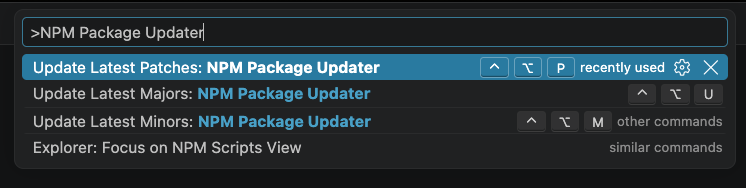

# NPM Package Updater

 

NPM Package Updater automatically checks for either the most up-to-date latest version of each dependency in your `package.json` file, or the latest minor or patch versions (both dependencies and devDependencies).

The extension automatically creates a `package.json.bak` file before updating so changes can be recovered even when the project is not under version control.

Be sure to **reinstall your packages** once complete by running `npm install` or `yarn install` in your terminal.

---

## Table of Contents

- [Features](#features)
  - [Update Latest Majors](#update-latest-majors)
  - [Update Latest Minors](#update-latest-minors)
  - [Update Latest Patches](#update-latest-patches)
- [Demo](#demo)
- [Settings](#settings)
  - [Indentation size & type](#indentation-size--type)
  - [Registry](#registry)
  - [Package file backup](#package-file-backup)
- [Useful links](#useful-links)

---

## Features

The following commands can be accessed from the VSCode [Command Palette](https://code.visualstudio.com/docs/getstarted/userinterface#_command-palette).

### Update Latest Majors

Run this command to get the most up-to-date version of all your packages.

Shortcuts:

- Windows/Linux: <kbd>ctrl</kbd>+<kbd>alt</kbd>+<kbd>u</kbd>
- macOS: <kbd>ctrl</kbd>+<kbd>option</kbd>+<kbd>u</kbd>

### Update Latest Minors

Run this command to get the most up-to-date minor and patch versions of all of your packages.

Shortcuts:

- Windows/Linux: <kbd>ctrl</kbd>+<kbd>alt</kbd>+<kbd>m</kbd>
- macOS: <kbd>ctrl</kbd>+<kbd>option</kbd>+<kbd>m</kbd>

### Update Latest Patches

Run this command to get the most up-to-date patch (non-breaking) versions of all of your packages.

Shortcuts:

- Windows/Linux: <kbd>ctrl</kbd>+<kbd>alt</kbd>+<kbd>p</kbd>
- macOS: <kbd>ctrl</kbd>+<kbd>option</kbd>+<kbd>p</kbd>

## Settings

### Indentation size & type

This extension allows for customisable indentation types of your package.json. Whether you prefer tabs or spaces it's your decision 😉 Look for the `Npm Package Updater: Indentation Size` & `Npm Package Updater: Indentation Type` settings.

### Registry

Update the registry used for fetching package details. You can use a registry different to the standard NPM one (which is set by default). For example if you're working for an organisation that has it's own registry. Look for the `Npm Package Updater: Registry` setting.

### Package file backup

`Npm Package Updater: Create Backup` is enabled by default and creates `package.json.bak` before dependencies are updated. Disable the setting if your project is already protected by version control and you do not want backup files.

## Useful links

[Semantic Versioning explanation](https://docs.npmjs.com/about-semantic-versioning).

## License

The source code is available under the [MIT License](LICENSE). The project icon and NPM Package Updater branding are excluded from that license and may not be copied, modified, or redistributed under the MIT terms.
